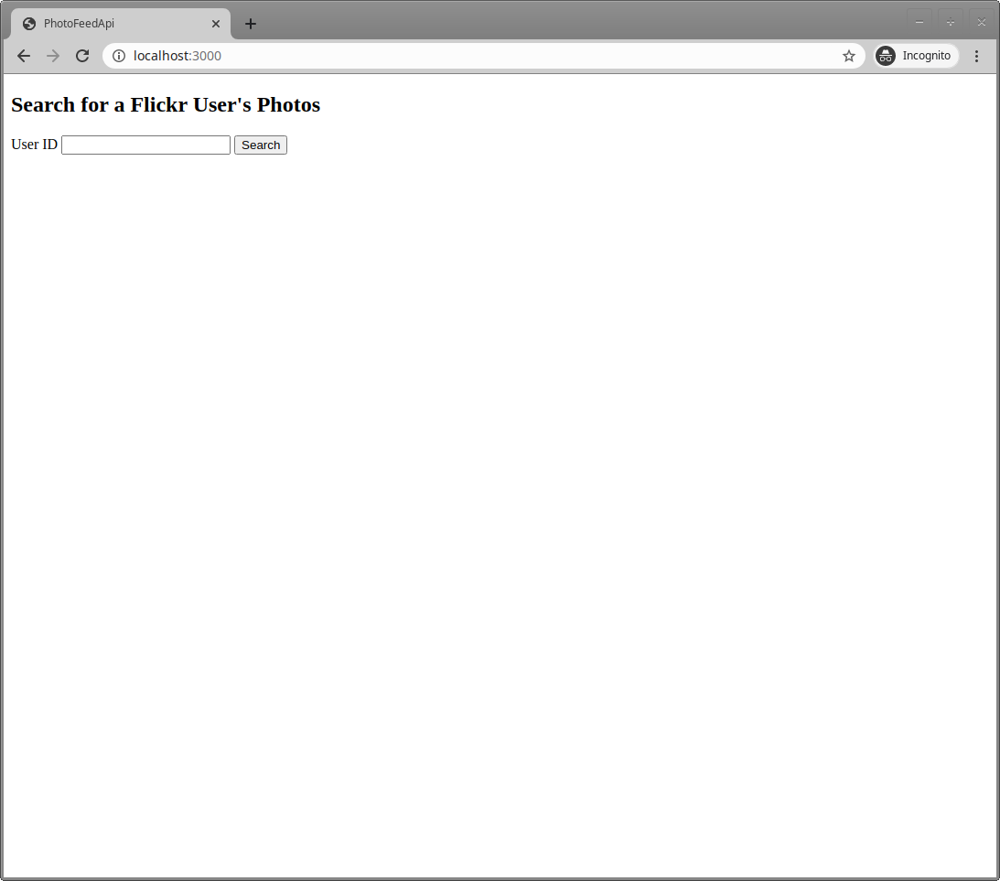
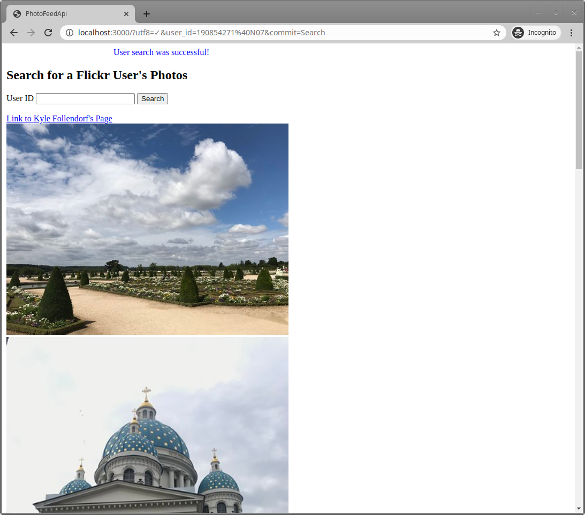

# Flickr Photo Feed API

A simple photo widget that allows you to display photos from your Flickr feed (or someone else’s).

## What I Learned

The purpose of building this website was to learn about how to use an API. The project exposed me to the process of searching API documents, how to receive an API key, and the various API methods that are available for providing information or doing the things that you want. I made a quick static homepage and a simple form to search for a Flickr user's ID, display a link to their profile, and show their pictures using the API methods that Flickr had provided in their documentation. Addtionally, I learned about using the gem <a href="https://rubygems.org/gems/figaro">figaro</a> and how to easily hide your API keys. Although this project was not the most difficult, it was nice to learn the general process of how to use an API and I am excited to include them in future projects.

### Gem List

- <a href="https://rubygems.org/gems/flickr">flickr</a>
- <a href="https://rubygems.org/gems/figaro">figaro</a>

### Homepage
  
